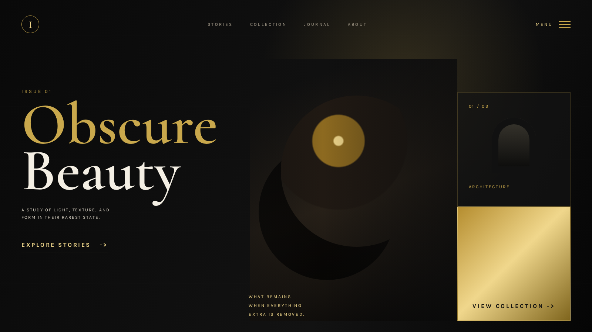
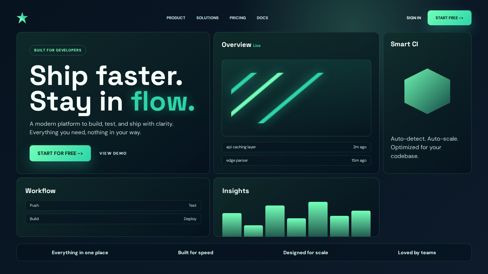
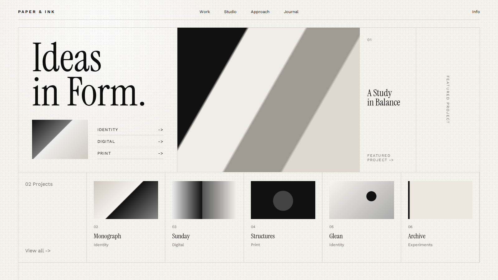
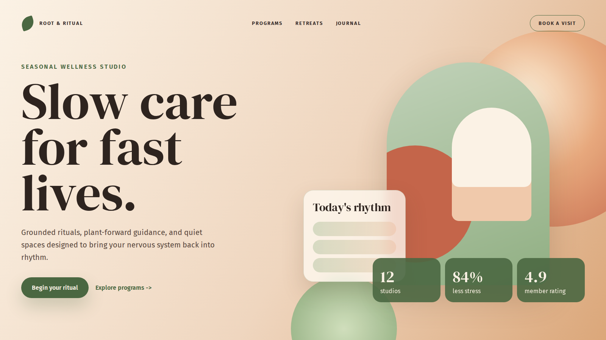
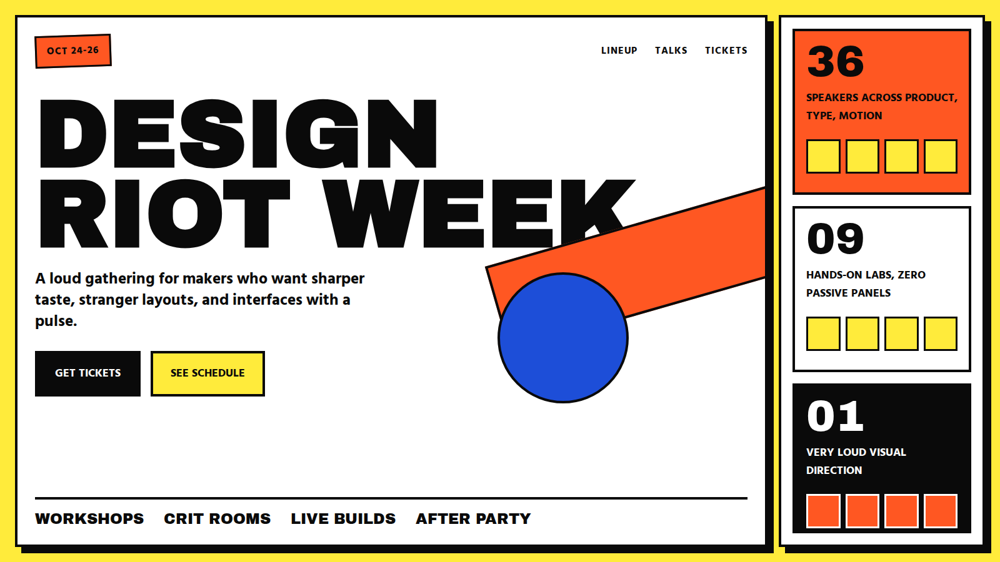
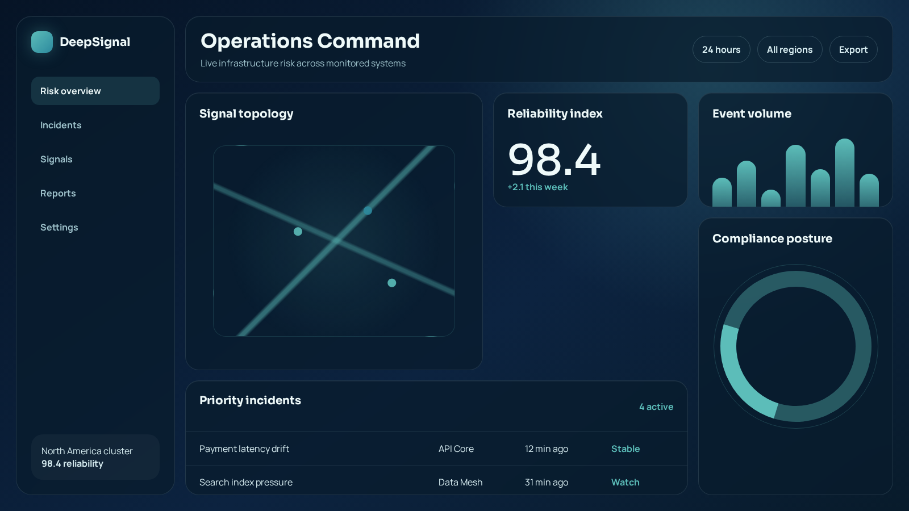

<div align="center">

# Lovable 设计系统技能

**一个可移植的、受 Lovable 启发的 Agent 前端设计品味层。**

</div>

这个仓库把 Lovable 风格前端生成背后的设计指导整理成一个可复用的 Agent Skill。它封装了提示词层面的设计哲学、精选的配色 / 字体 / 布局预设、帮助 Agent 避免通用 AI 味道的交互流程，以及把用户审美选择固化到本地 `styleguide.md` 的工作方式。

> [!NOTE]
> 这是一个非官方技能，不隶属于 Lovable，也未获得 Lovable 的认可或维护。

## Showcase

下面 6 张图来自仓库里的真实 HTML 页面，并通过 Playwright 截图生成。它们不是 AI 生成的 mockup，而是这个 Skill 可以指导 Agent 落地的不同 layout 和视觉方向示例。

| Noir & Gold / 编辑杂志 | Neon Mint / 产品 Bento |
| --- | --- |
|  |  |
| Paper & Ink / 作品集 Gallery | Terracotta & Sage / Split Screen |
|  |  |
| Brutalist Pop / 活动 Schedule | Ocean Deep / Enterprise Dashboard |
|  |  |

## 它能做什么

`lovable-design-system` 会在编码 Agent 编写界面代码之前，为它提供更强的设计简报：

| 能力 | 技能提供的内容 |
| --- | --- |
| 设计品味 | 面向大胆、非模板化前端设计的清晰理念 |
| 视觉预设 | 26 套配色、15 组字体搭配、15 种布局原型 |
| 决策流程 | 判断何时询问视觉偏好、何时直接开始构建的规则 |
| 图片预览 | 在支持图片生成的环境中，为视觉选项生成 UI mockup 预览 |
| 重设计流程 | 生成并应用设计方向的结构化流程 |
| 风格固化 | 将用户选定的审美方向写入本地 `styleguide.md`，后续直接复用 |
| 实现约束 | 基于 Tailwind / CSS 变量的设计令牌建议，以及基础 SEO 默认规则 |

当你在构建或优化落地页、营销网站、作品集、产品界面、仪表盘，以及其他对视觉质量有要求的前端体验时，可以使用它。

## 快速开始

### 安装技能

```sh
npx skills add Mine77/lovable-design-skills
```

### 使用技能

安装后，在设计界面时让 Agent 使用这个 Skill：

```text
使用 lovable-design-system 技能重设计这个落地页。
```

## 致谢

本项目基于受 Lovable 启发的设计提示词模式整理而成，并进一步组织为一个与具体框架无关的 Agent 参考系统。
